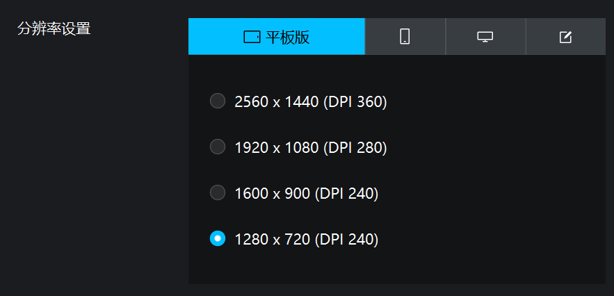
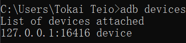

# D4AS
A script for autoplaying D4DJ Groovy Mix (JP only).

*Author: ゼカツまし*

## LOGS
### TODOs
- Pack the script into exe
- Add UI (maybe won't)
- Add more settings that can be set automatically other than manually in game

### Recent Updates
#### Oct 31, 2024
- Add auto-restart methods to solve possible crash of the game.
- Provide a solution for being blocked from long-time plays.
See more information about it [here](#solutions-for-swipe-verification).
- Fix the trigger condition of timeout restart.

#### Oct 26, 2024
- Add support for event type: raid
- Voltage supplement fixed

## Requirements
- Get your simulator ready. [MuMu Player 12](https://mumu.163.com) is recommended.
- Download [the latest version of python](https://www.python.org/downloads/) and follow the instructions to install.
- Install environment: run `pip install opencv-python==4.10.0.84 pygetwindow==0.0.9 keyboard==0.13.5` in cmd.
- Make sure you've got adb installed (usually comes with the simulator).
For MuMu user, adb can be found at `MuMuPlayer-12.0\shell\adb.exe`.

## Preparations
Set your simulator and make sure the resolution is set to 1280*720.

Install D4DJ and log into your account.

Test adb.
Run `adb devices` in cmd to show the devices that are currently connected to adb.

Then fill the address into `serial` field in `config.json`.
For those with multiple devices, figure out which device D4DJ is running on
and fill in that address.

## Usage
### General
Run `python main.py` under root directory to start the script.
(Planning to pack it into exe in near future)

Normally you should change the config to make the script run properly.
You may refer to [Customization](#customization) to customize the script.

Also make sure to read the [Cautions](#cautions) before running the script.

### Customization
Here are fields you can change in `config.json`:

#### `general`
- `timeout`: Number of minutes before the game stays no-response and has to be restarted.
It should not be less than 5.

#### `play`
- `do_vrf`: Whether to complete the swipe verification.
See more info [here](#solutions-for-swipe-verification).
- `rest_interval`: Time interval between rests to avoid the verification.
Formatted as `h:mm` (No exceeding 4 hours).
Also see more info [here](#solutions-for-swipe-verification).

#### `tasks`
- `event_type`: Valued among `raid`, `poker`, `yell` and `battle`,
depending on which event type you are running the script for.
- `mode`: Valued among `solo`, `multi` and `sp`.
Some events may not have sp lives and the script may not work under that situation.

More settings, such as voltage recognition, will be added later (probably this year?).

The `res` folder stores buttons or features for opencv to recognize.
Under experiencing failure in recognizing a specific button or status (see the `res/stat` folder),
you may screenshot and add or replace the original png files with yours.
File names are not considered but make sure all you put are png files.

If you want to deactivate some of the buttons or status,
you may just place a `_` at the beginning of the file name,
then it will be ignored.

### Cautions
Make sure that:
- Auto mode is switched on within the game
- Proper voltage usage is set
- Under some circumstances you may need to get your room selected in advance when there are multiple choices

before starting the script.

By the way you are recommended to set your background static
(disable club motion/skill window/groovy effect, set bg to music jacket/character, etc.)
and screenshot a static part of your live screen and replace the image in the `res/stat/live` folder with it
to help the script to recognize the live status. Loop time recorder based on live screen may be provided in later updates.
You may delete the old images in the `live` folder since that's my background.

You may also need to replace the images in `/res/stat/main` and `/res/stat/live_sel` to fit your UI theme.
Remember only to take static icons (as presented in the original images).

### Solutions for swipe verification
#### Fight Against (proved to be feasible)
Record a route of your passing the verification within your simulator and set the trigger key to `G`.
Whenever the verification is detected, your simulator window will be activated to front,
the `G` key will be triggered, and then you'll be able to continue playing.

A problem with it, however, is that the action may interrupt some of your works (especially when you are playing games)
by popping up the simulator window as the focus. So turn it off if you get crucial works to do.

#### Avoid being blocked (not verified yet)
Have a 15-minute rest every two and a half hour (preset value can be changed) to avoid being challenged.
Well I'm not quite sure whether it works, but I wish it could.

## Finally
Enjoy your playing D4DJ.
You are welcome to contact me if you have any problems with the script
(since it's highly uncompleted).